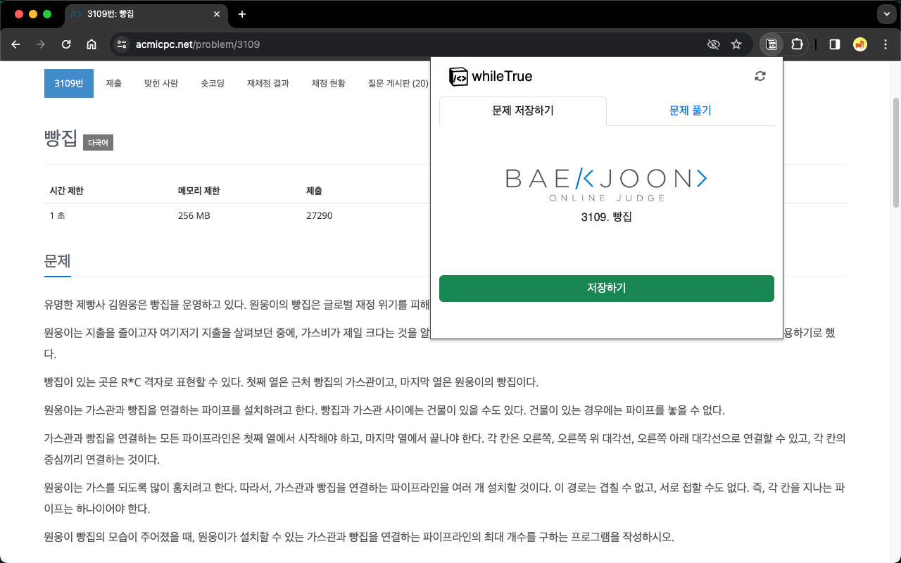
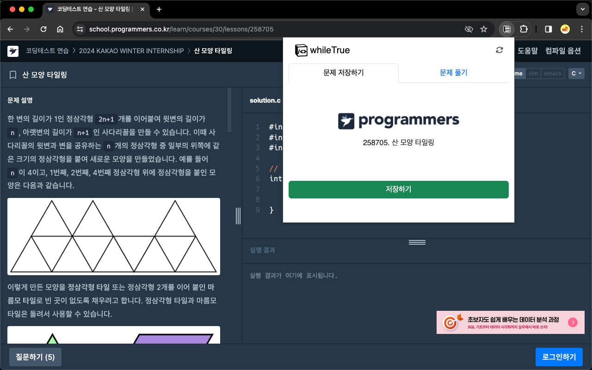
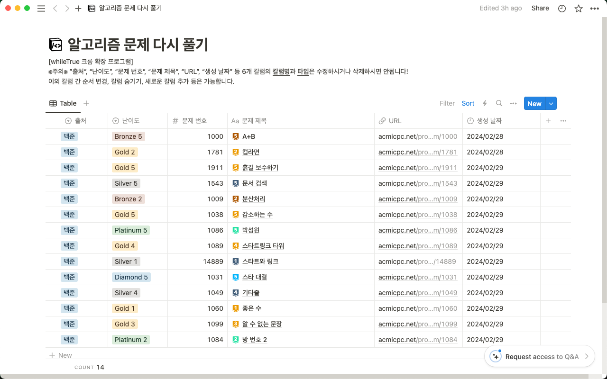

    
    <h1>whileTrue</h1>

     

 

# 설치하기

   

# whileTrue 확장 프로그램

다시 풀고 싶은 알고리즘 문제를 더욱 편리하게 노션에 기록해보세요. 이후, 노션 데이터베이스에 저장된 알고리즘 문제들을 랜덤으로 뽑아 다시 풀어볼 수 있습니다.

\*백준 온라인 저지와 프로그래머스를 지원합니다.

<table>
  <tr>
    <td align="center">
        
    </td>
    <td align="center">
        
    </td>
  </tr>
  <tr>
    <td align="center">
        <b>백준 문제 저장</b>
    </td>
    <td align="center">
        <b>프로그래머스 문제 저장</b>
    </td>
  </tr>
  <tr>
    <td align="center">
        
    </td>
    <td align="center">
        
    </td>
  </tr>
  <tr>
    <td align="center">
        <b>문제 랜덤 추출</b>
    </td>
    <td align="center">
        <b>저장된 문제 리스트</b>
    </td>
  </tr>
</table>

# 시작하기

[ [시작 가이드 바로가기](https://github.com/namgons/whileTrue/blob/main/start_guide.md) ]

# 기여하기

- 새로운 기능 제안, 질문 등은 [Discussions](https://github.com/namgons/whileTrue/discussions)을 활용해주세요.
- 버그, 이슈 제보는 [Discussions](https://github.com/namgons/whileTrue/discussions)에 남겨주시거나 [Issues](https://github.com/namgons/whileTrue/issues)를 생성해주세요.

# 관련 링크

- [whileTrue 프로젝트 후기](https://dotpointing.tistory.com/3)
