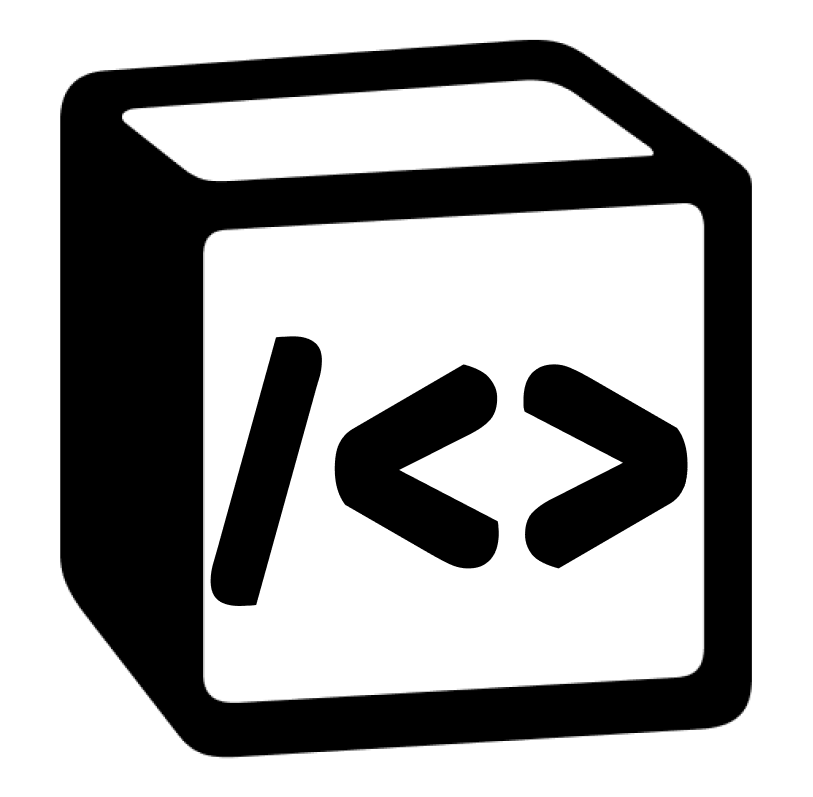

    
    <h1>whileTrue</h1>

 

# whileTrue 확장 프로그램

다시 풀고 싶은 알고리즘 문제를 더욱 편리하게 노션에 기록해보세요. 이후, 노션 데이터베이스에 저장된 알고리즘 문제들을 랜덤으로 뽑아 다시 풀어볼 수 있습니다.

# 시작하기

1. 크롬 웹 스토어에서 whileTrue를 설치한 후, 크롬의 우측 상단에서 설치된 whileTrue을 클릭합니다.
2. Notion 로그인을 진행합니다.
3. whileTrue와 공유할 워크스페이스, 페이지를 선택합니다.
   - whileTrue에서 제공하는 템플릿을 사용하는 것을 추천합니다.
4. 문제를 저장할 노션 데이터베이스 링크를 공유합니다.

   - whileTrue에서 제공하는 템플릿을 사용하는 경우 : 워크스페이스에 복제된 노션 데이터베이스의 링크를 공유합니다.
   - <b>(※주의※) 기존의 노션 데이터베이스를 사용하는 경우</b> : 아래의 조건을 모두 만족해야 합니다.

     1. 데이터베이스 형식이어야 합니다.
     2. 3번 단계에서 공유한 워크스페이스, 페이지 아래에 있어야 합니다.
     3. 다음과 같은 칼럼명과 속성을 가지는 칼럼이 존재해야 합니다.
        | 칼럼명 | 속성 |
        |:------:|:------:|
        | "출처" | select 타입 |
        | "난이도" | select 타입 |
        | "문제 번호" | number 타입 |
        | "문제 제목" | title 타입 |
        | "URL" | url 타입 |

        

# 기여하기

- 새로운 기능 제안, 질문 등은 [Discussion](https://github.com/namgons/whileTrue/discussions)을 활용해주세요.
- 버그, 이슈 제보는 [Discussion](https://github.com/namgons/whileTrue/discussions)에 남겨주시거나 [Issue](https://github.com/namgons/whileTrue/issues)를 생성해주세요.
