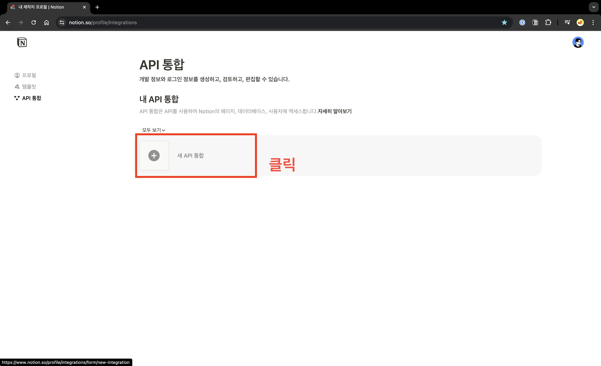
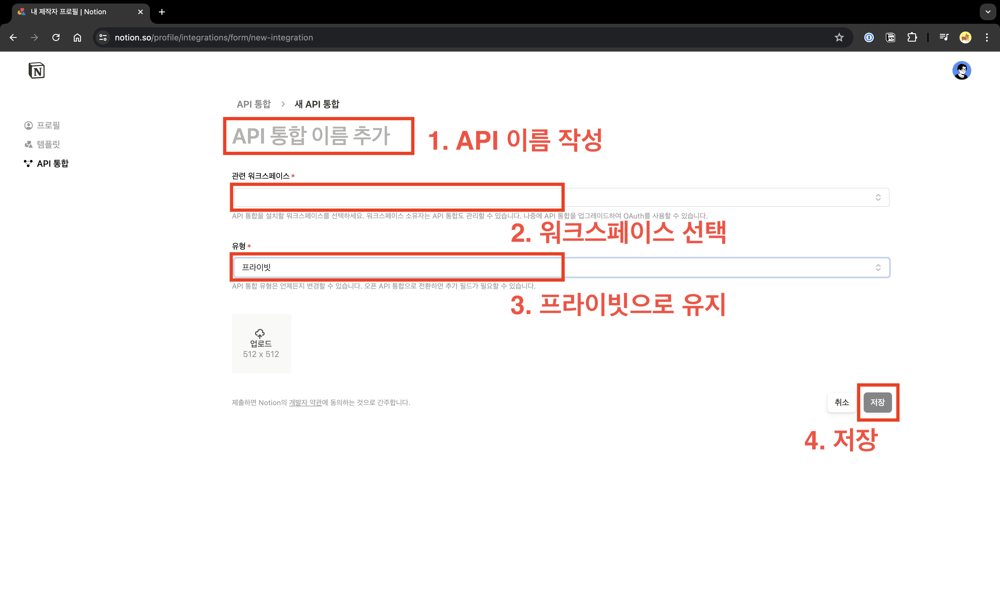
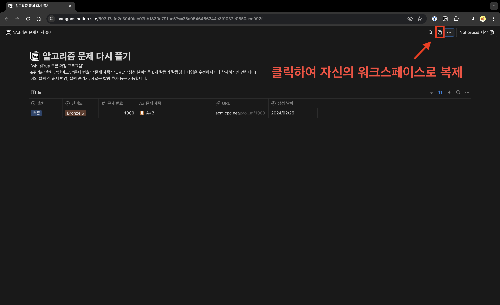
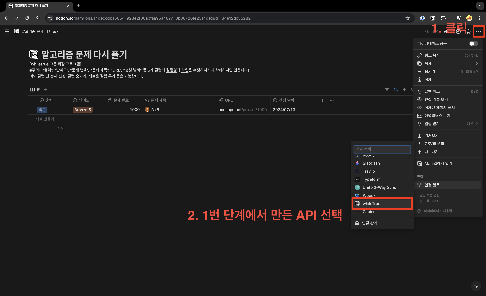
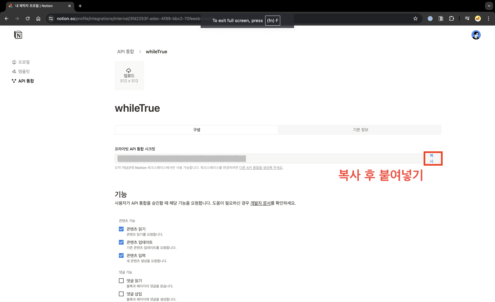

# Notion 연결하기

## 1. Notion API Key 생성하기

> 이미 생성된 Notion API Key가 있는 경우, 이 단계는 건너뛰어도 됩니다.
> Notion 데이터베이스가 있는 워크스페이스에 접근할 수 있는 API Key인지 확인해주세요.

1. Notion API 통합으로 이동하기 [ [바로가기](https://www.notion.so/profile/integrations) ]

2. "새 API 통합" 만들기

## 2. Notion 템플릿 복제하기

> 기존에 사용하던 템플릿이 있는 경우, 이 단계는 건너뛰어도 됩니다.

1. Notion API Key를 생성할 때 선택한 워크스페이스 아래에 템플릿을 복제합니다. [ [템플릿 바로가기](https://namgons.notion.site/603d7afd2e3040feb97bb1830c791bc5?v=28a0546466244c3f9032e0850cce092f&pvs=4) ]

## 3. Notion 데이터베이스에 API 연결하기

1. 복제된 Notion 데이터베이스로 이동합니다.

2. 우측 상단의 설정 버튼을 클릭합니다.

3. "연결"의 "연결 항목"을 선택합니다.

4. 1단계에서 본인이 생성한 API를 선택 후 연결합니다.

## 4. whileTrue에 Notion API Key와 데이터베이스 URL 공유하기

1. 1단계에서 생성한 API Key를 공유합니다.

2. Notion 데이터베이스 URL을 공유합니다.

3. "공유하기" 버튼을 클릭합니다.

## 주의점

- 생성한 Notion API가 접근할 수 있는 워크스페이스에 Notion 데이터베이스가 있는지 확인해주세요.

- Notion 데이터베이스에 생성한 API가 연결되었는지 확인해주세요.

- <b>(❌주의❌) 기존의 노션 데이터베이스를 사용하는 경우</b> : 아래의 조건을 모두 만족해야 합니다.

  1.  데이터베이스 형식이어야 합니다.
  2.  3번 단계에서 공유한 워크스페이스, 페이지 아래에 있어야 합니다.
  3.  다음과 같은 칼럼명과 속성을 가지는 칼럼이 존재해야 합니다.
      | 칼럼명 | 속성 |
      |:------:|:------:|
      | "출처" | select 타입 |
      | "난이도" | select 타입 |
      | "문제 번호" | number 타입 |
      | "문제 제목" | title 타입 |
      | "URL" | url 타입 |

      
